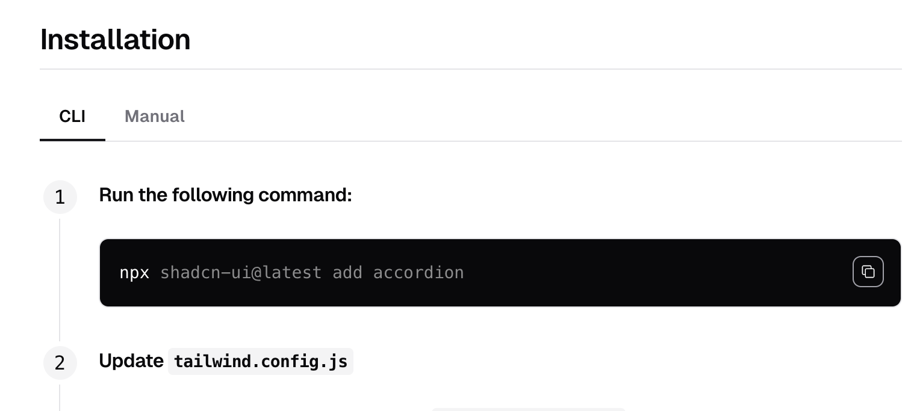

This folder is reserved for components originated from https://ui.shadcn.com/

Check out https://ui.shadcn.com/docs/components/accordion for information on which components are available and how to use them.

Find the installation section of a component, and the command to install it will look like this:

```bash
pnpm dlx shadcn-ui@latest add accordion
```

Notice the copy icon on the top right of the code block. You will be presented with a list of options for which pack    age manager you want to use, we recommend using `pnpm`.

Click it to copy the command to your clipboard.

